# Фреймворк Django (семинары)
# Урок 1. Введение в Django
## Описание
На этом семинаре мы:
- научимся установке и настройке для первого запуска;
- изучим структуру проекта и работу с ним;
- узнаем о приложениях как частях проекта;
- изучить настройки логирования в Django. 

<br><hr>
## Домашнее задание
Уважаемые студенты! Обращаем ваше внимание, что сдавать домашнее задание необходимо через Git. <br>
Задание: <br>
Создайте пару представлений в вашем первом приложении: <br>
    - главная
    - о себе. <br>
Внутри каждого представления должна быть переменная html - многострочный текст с HTML-вёрсткой и данными о вашем первом Django-сайте и о вас. <br>
Сохраняйте в логи данные о посещении страниц.
<br><hr>
## Решение задания

<br><br>
### 1. Установка Python

Перед началом следует проверить, что установлен Python командой:
```bash
python --version
```

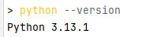

Если Python отсутствует, скачать установщик с официального сайта [https://www.python.org/downloads/](https://www.python.org/downloads/), следуя инструкциям установки. <br> 
Обязательно отметить пункт **Add Python to PATH**.<br>

<br><br>
### 2. Установка виртуального окружения (venv)

Следует установить Django внутри виртуальной среды для изоляции зависимостей проекта от глобальных пакетов системы. <br>
Для этого открыть командную строку (`cmd.exe`):

- Создание виртуального окружения:
```bash
mkdir e:\first_project && cd /d e:\first_project
python -m venv myenv
```
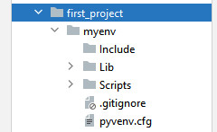

- Активация виртуального окружения (для активации ввести команду):
```bash
myenv\Scripts\activate.bat
```
- Альтернативный способ - использовать встроенную оболочку виртуального окружения в PowerShell:, где вместо .bat сценария, использовать специальный скрипт для PowerShell:
```
.\myenv\Scripts\Activate.ps1
```

Однако этот сценарий требует разрешения на выполнение скриптов PowerShell, для чего временно нужно разрешить выполнение всех сценариев, выполнив команду:
```
Set-ExecutionPolicy Bypass -Scope Process
```

После успешного завершения работы с виртуальной средой, вернуть политику безопасности обратно (обязательно):
```
Set-ExecutionPolicy Restricted
```

**Теперь перед приглашением командной строки появится название виртуальной среды `(myenv)` - это значит, что среда активирована**.

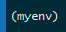

- Дополнительно проверить, что путь к виртуальному окружению правильный и соответствует структуре каталога проекта.
- Проверить наличие под-папки Scripts в виртуальном окружении, где должны находиться файлы activate.bat и Activate.ps1.

<br><br>
### 3. Установка Django

Нужно проверить, что виртуальное окружение активно, и выполнить команду, которая загрузит последнюю стабильную Django:
```bash
pip install django
```

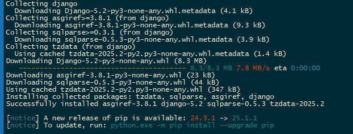 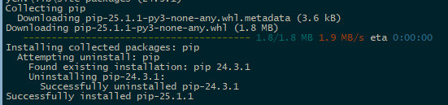

Проверка успешной установки Django:
```bash
django-admin --version
```
Версия Django должна отображаться корректно.

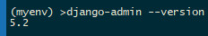

<br><br>
### 4. Создание проекта Django

Создать новый проект Django можно следующей командой:
```bash
django-admin startproject first_project .
```
, где точка `.` означает создание структуры проекта прямо в текущей директории `E:\first_project`.

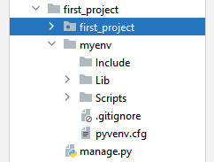

<br><br>
### 5. Структура приложения и представление

Внутри проекта нужно создать приложение, которое будет содержать две страницы-представления («Главная», «О себе»).

- Создать новое приложение внутри проекта:
```bash
python manage.py startapp main_app
```
Эта команда создаст новую директорию `main_app`, куда поместятся файлы будущего приложения.

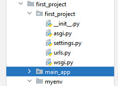

Затем требуется включить приложение в список установленных приложений для всего проекта. <br> 

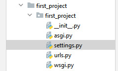

Для этого, открыть файл настроек проекта `settings.py` (он находится в корневой директории проекта) <br>
и добавить имя нового приложения в секцию INSTALLED_APPS:
```
INSTALLED_APPS = [
    # ...
    'main_app',
]
```

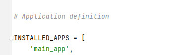


<br><br>
### 6. Создание представлений (views)

Теперь требуется создать непосредственно два простые представления, каждое из которых будет выводить собственный HTML-код.

- Открыть файл `views.py` в каталоге приложения `main_app`. Написать код следующим образом:

```
from django.shortcuts import render
import logging

# Настройка журнала
logger = logging.getLogger(__name__)

def home(request):
    logger.info('Страница "Главная" была открыта.')
    return render(request, 'home.html')

def about_me(request):
    logger.info('Страница "О себе" была открыта.')
    return render(request, 'about_me.html')
```

- Создать соответствующие шаблоны. <br> 
  Для этого создать каталог `templates` в директории приложения `main_app` и положить туда два файла: `home.html` и `about_me.html`.

Файл `home.html`:
```
<!DOCTYPE html>
<html lang="ru">
<head>
    <meta charset="UTF-8">
    <title>django-site</title>
</head>
<body>
<h2>Здравствуйте!</h2>
<h1>Добро пожаловать на сайт Django.</h1>
<p>Этот django-сайт сделан с использованием фреймворка "Django".</p>
</body>
</html>
```

Файл `about_me.html`:
```
<!DOCTYPE html>
<html lang="ru">
<head>
    <meta charset="UTF-8">
    <title>django-site</title>
</head>
<body>
<h1>Привет! Я автор этого сайта.</h1>
<p>Задачи этого сайта - показать возможности Django</p>
<p>Моя задача - составить рассказ "Немного о себе".</p>
</body>
</html>
```

<br><br>
### 7. Маршрутизация (urls)

Необходимо также настроить маршруты для представлений. Эти пути будут обрабатывать запросы к страницам.<br> 

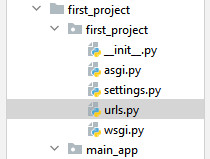

Файл маршрутов расположен в корневом проекте (`first_project/urls.py`), открыть его и внести изменения:

```
from django.contrib import admin
from django.urls import path
from main_app.views import home, about_me

urlpatterns = [
    path('', home, name='home'),
    path('about/', about_me, name='about'),
    path('admin/', admin.site.urls),
]
```

<br><br>
### 8. Применение миграций

Для работы приложения и подготовки базы данных, нужно применить миграции. <br>  
Применение миграций является важным этапом практически любого Django-проекта, тогда проект будет готов к дальнейшему развитию и тестированию. <br>
Если миграция проходит успешно, база данных будет подготовлена, в браузере будет стандартный вывод о запуске сервера, без предупреждений о необходимости применить миграции.

1. Применить миграции, эта команда применяет необходимые миграции, создавая структуру таблиц <br> 
   в базе данных, необходимую для функционирования Django-проекта. <br>  
   Выполнить следующую команду в терминале:
   ```bash
   python manage.py migrate
   ```  

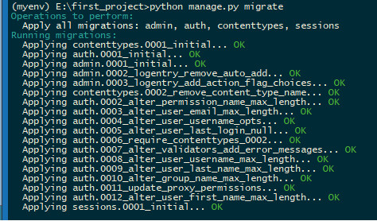

2. Проверить статус проекта:
   ```bash
   python manage.py runserver
   ```
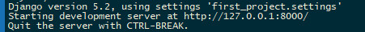

После выполнения команды запустить сервер на localhost.

<br><br>
### 9. Запуск сервера

После выполнения указанной команды указанной команды ```python manage.py runserver```, можно запустить сервер django. <br>
Для запуска сервера, в браузере запустить локальный хост по адресу http://localhost:8000/. <br>

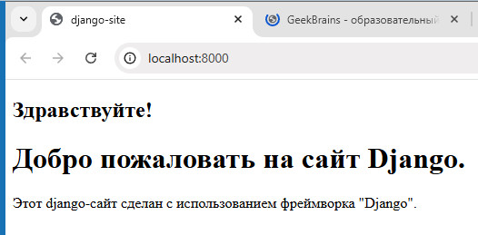

Следует перейти по этому адресу и проверить обе страницы: <br> 
главную страницу `/` и страницу «О себе» `/about/`, перейдя по адресу в браузере, соответственно:
- http://localhost:8000/
- http://localhost:8000/about/

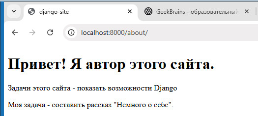


<br><br>
### 10. Логирование запросов

При каждом открытии страницы информация будет записываться в файл `debug.log`, <br> 
расположенный рядом с проектом. <br>
Следует настроить ведение журналов в представлении с помощью модуля `logging`. <br>
Чтобы была возможность видеть журналы действий пользователей, необходимо добавить настройки для логирования в файл `settings.py`:

```
LOGGING = {
    'version': 1,
    'disable_existing_loggers': False,
    'handlers': {
        'file': {
            'level': 'INFO',
            'class': 'logging.FileHandler',
            'filename': 'debug.log',
        },
    },
    'loggers': {
        'django': {
            'handlers': ['file'],
            'level': 'INFO',
            'propagate': True,
        },
    },
}
```

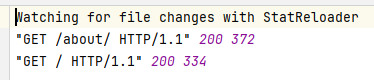


<br><br>
### 11. Остановка сервера

После окончания работы с сервером Django требуется остановка сервера или деактивация, выход из локального окружения. <br>
- Всегда останавливать сервер перед переходом к другим действиям.
- Использовать команду `deactivate` только после того, как вышли из запущенного сервера Django.
- Новый проект можно создавать сразу после освобождения консоли путём остановки текущего сервера.
- Если сервер не остановить, консоль останется заблокированной процессом Django, и никакие новые команды не смогут быть выполнены.
- Деактивация виртуального окружения возможна только тогда, когда оно было предварительно активировано.

Сервер Django остановится автоматически, если отправить сигнал прерывания процесса. <br> 
Для этого можно воспользоваться комбинацией клавиш: <br>
- В Windows или Linux: **Ctrl+C**
- В macOS: **Command + C**

После нажатия комбинации клавиш сервер завершит свою работу, и можно вводить команды в консоли. <br>
Ввести команду деактивации, которая вернет обратно в глобальную среду системы разработки:
```bash
deactivate
```

- Когда команда деактивации выполнена, можно приступить к созданию нового <br>
  проекта (и приложения), например, `second_project` с помощью команды:
```bash
django-admin startproject second_project .
```

<br><br>
### 12. Доработка и создание шаблона наследования 

Шаблонное наследование в Django позволяет избегать дублирования кода. <br>
Можно изменить страницы html в проекте, чтобы оптимизировать реализацию, добавив базовый шаблон. <br>
Проектная реализация становится компактнее, удобнее для поддержки и расширения функционала приложений. <br>
От базового шаблона будут наследоваться остальные страницы. <br>

Преимущества архитектуры с наследованием: <br>
- Сокращение дублирующегося кода, так как общие элементы интерфейса больше не копируются.
- Легкость внесения изменений в интерфейс, потому что достаточно обновить лишь базовый шаблон.
- Чище и понятнее структура кода, что облегчает поддержку проекта на любом этапе проектирования.


1. Создать общий родительский шаблон - базовый шаблон (base.html), <br>
   который должен содержать общую разметку и стили, общие элементы интерфейса (header, footer), <br>
   а дочерние шаблоны будут расширять его.

```
<!-- base.html -->
<!DOCTYPE html>
<html lang="ru">
<head>
    <meta charset="UTF-8">
    <title></title>
</head>
<body>
<div class="container">
    
    <!-- Общие элементы заголовка -->
    <header>
        <h1>Мой первый Django-сайт</h1>
    </header>
    
    
    
    <!-- Здесь будет основной контент страницы -->
    

    
    <!-- Общие элементы подвала -->
    <footer>
        <p>&copy; {{ current_year }} Мой первый Django-сайт</p>
    </footer>
    
</div>
</body>
</html>
```

2. Добавить файл `base.html` в папку `templates/`. То есть, базовый шаблон (base.html) лежит непосредственно 
   в директории `first_project/main_app/templates/`, вне какой-то конкретной подпапки приложения. <br>
   Такой подход позволит использовать этот шаблон в любом другом приложении проекта. <br> 
   По соглашениям Django, лучше хранить базовые шаблоны отдельно от специфичных шаблонов конкретных приложений. <br><br>

3. Изменить содержание файлов `home.html` и `about_me.html`, <br>
   чтобы они использовали наследование от `base.html`, где
- Шаблон главной страницы (home.html)
```


django-site


<h2>Здравствуйте!</h2>
<h1>Добро пожаловать на сайт Django.</h1>
<p>Этот django-сайт сделан с использованием фреймворка "Django".</p>

```

- Шаблон страницы "О себе" (about_me.html)
```


django-site


<h1>Привет! Я автор этого сайта.</h1>
<p>Задачи этого сайта - показать возможности Django</p>
<p>Моя задача - составить рассказ "Немного о себе".</p>

```

4. В папке `/templates/` создать папку шаблонов данного проекта `/main_app`. <br><br>

5. Конкретные шаблоны home.html и about_me.html, принадлежащие приложению main_app, <br>
   расположить в директории `/main_app` этого приложения: `first_project/main_app/templates/main_app/home.html`. <br>
   Так как специфичные шаблоны, такие как home.html и about_me.html, должны лежат в подпапке <br> 
   своего приложения (main_app), как положено согласно документации Django. <br>
   А базовый шаблон base.html, который будет использоваться всеми приложениями, рекомендуется размещать на верхнем уровне. <br><br>

6. Код контроллеров остаётся без изменений, так как наследование осуществляется на уровне шаблонов. <br><br>

7. Открыть файл settings.py и найти раздел TEMPLATES. <br> 
   Добавить правильный путь к шаблонам в строку ````'DIRS':````, чтобы Django определил, <br>
   что специфичные шаблоны находятся внутри папки `main_app/templates/main_app`:
```
TEMPLATES = [
    {
        'BACKEND': 'django.template.backends.django.DjangoTemplates',
        'DIRS': [BASE_DIR / 'main_app/templates/main_app'],
        'APP_DIRS': True,
        'OPTIONS': {
            'context_processors': [
                'django.template.context_processors.debug',
                'django.template.context_processors.request',
                'django.contrib.auth.context_processors.auth',
                'django.contrib.messages.context_processors.messages',
            ],
        },
    },
]
```

<br><br>
### 13. Повторный и последующие запуски локального сервера

1. Перейти в корневую директорию проекта: ```/first_project```
2. В корневой папке проекта запустить виртуальное окружение: ```myenv\Scripts\activate.bat```
3. Выполнить инсталляцию фреймворка Django в данное виртуальное окружение: ```pip install django```
4. Запустить локальный сервер: ```python manage.py runserver```
5. Открыть браузер на адресе локального сервера: ```http://localhost:8000/```
6. После окончания работы с локальным сервером, остановить виртуальное окружение нажатием комбинации клавиш `Ctrl+C`
7. Выполнить деактивацию виртуального окружения: ```.\myenv\Scripts\deactivate.bat```


<br><hr>
## Инструкция

### Программное обеспечение
Для успешного выполнения проекта с помощью фрейморка Django потребуется следующее программное обеспечение:
- **Python** версии 3.x (рекомендуется последняя стабильная версия)
- **PIP** — менеджер пакетов Python (обычно идет вместе с Python)
- **Командная строка Windows Terminal** или стандартный терминал PowerShell/Command Prompt
- Желательно установить редактор кода (например, Visual Studio Code, PyCharm).

### 1. Проверка наличия Python и PIP

Открыть окно терминала (Windows Terminal / Command Prompt). Эти команды покажут версию установленного Python и PIP соответственно:

```bash
python --version
pip --version
```
Если установлена устаревшая версия Python (< 3.8), рекомендуется обновить её до актуальной.

### 2. Установка Python (при необходимости)

Если Python ещё не установлен, выполнить следующую команду в терминале для автоматической загрузки установщика Python:

```bash
winget install Python.Python.3
```

Подтвердить установку и дождаться завершения процесса.


### 3. Создание каталога для Django-проектов

Создать директорию специально для учебных проектов, например, DjangoProjects:

```bash
mkdir ~\DjangoProjects
```

Теперь перейти внутрь папки `DjangoProjects`:

```bash
cd ~\DjangoProjects
```
Пример:
```
# Перейти на нужный диск на компьютере
# Создать новый каталог для Django-проектов

mkdir DjangoProjects

# Переместиться внутрь новой директории

cd DjangoProjects
```

### 4. Развёртывание виртуального окружения

Использование виртуальных окружений помогает изолировать зависимости различных проектов друг от друга и избегать конфликтов версий библиотек.

#### Установка пакета virtualenv (если он отсутствует):

```bash
pip install virtualenv
```

Затем создать виртуальное окружение внутри директории с проектами, например, DjangoProjects:

```bash
virtualenv venv
```
, где `venv` - название виртуального окружения, которая будет храниться в отдельной папке рядом с проектами. <br>
Рекомендуется создать отдельное виртуальное окружение для каждого проекта. <br>
```
python -m venv venv
```
Пример структуры проектов и виртуальной среды:
```
C:\DjangoProjects\
C:\DjangoProjects\venv           # Виртуальная среда
C:\DjangoProjects\project_name   # Каталог конкретного проекта

```

### 5. Активация виртуального окружения

Чтобы активировать виртуальное окружение, использовать следующую команду:

```bash
.\venv\Scripts\activate
```
Теперь приглашение в консоли изменится, показывая имя активного виртуального окружения (`(venv)` перед командой). <br>
Это означает, что теперь все устанавливаемые пакеты будут попадать именно в это окружение, а не глобально на систему. <br>
**Все дальнейшие команды выполняются и относится исключительно к этому конкретному окружению.**

### 6. Установка Django

- Установить последнюю доступную версию Django непосредственно в виртуальном окружении:

```bash
pip install django
```

- Проверить успешность установки, запустив команду проверки версии Django. Это подтвердит, что установка прошла успешно:

```bash
django-admin --version
```

### 7. Создание проекта и приложения Django

- Создать проект командой с названием проекта, например 'mysite':

```
django-admin startproject mysite .
```

, где mysite - произвольное название нового проекта.

- Пройти внутрь созданного проекта:
```
cd mysite
```
- Создать приложение внутри проекта, например, название приложения 'blog':
```
python manage.py startapp blog
```

### 8. Подключение приложения к проекту

Подключеным к проекту должно быть каждое приложение, чтобы фреймворк Django мог распознавать и обрабатывать запросы всех подключенных приложений. <br>
Открыть файл настроек проекта `settings.py`, который находится в подпапке проекта, <br> 
примерно по адресу `./mysite/mysite/settings.py` и добавить строку в секцию INSTALLED_APPS:

```
INSTALLED_APPS = [
    ...
    'blog',  # Имя приложения
]
```

### 9. Запуск встроенного Django сервера

Проверить работоспособность Django путем запуска встроенного тестового сервера. <br>
Запускать сервер командой:

```bash
python manage.py runserver
```

По умолчанию сервер запускается на порту 8000, по адресу: http://localhost:8000/. <br>
Открыть браузер и перейти по указанному адресу. Если все сделано верно, то будет вызвано приветственное сообщение Django.

<br><hr>
## Дополнительная информация

<br><br>
### Виртуальные окружения

Виртуальные окружения помогают избежать проблем совместимости между разными версиями библиотек и позволяют хранить разные конфигурации зависимостей отдельно для каждого проекта. <br> 
В Python виртуальные окружения используются для изолированного управления пакетами, установленными библиотеками и зависимостями отдельных проектов. <br>
Например, один проект может требовать Django 3.x, другой — Django 4.x, и благодаря виртуальным окружениям они смогут сосуществовать без конфликта. <br>
Таким образом, виртуальное окружение помогает избежать множества проблем, связанных с управлением зависимостями, обеспечивая удобство и надежность при разработке нескольких проектов параллельно. <br>

##### Основные причины использования виртуального окружения:

1. Изоляция проектов, то есть, когда выполняется работа над несколькими проектами одновременно, каждому проекту часто требуются разные версии одних и тех же библиотек. Если пакеты установлены глобально, существует риск конфликтов версий между проектами. Виртуальная среда позволяет каждому проекту иметь свою собственную уникальную коллекцию установленных модулей, исключающую конфликты между ними.
<br><br>
2. Совместимость и стабильность - это особенно актуально, когда разные проекты требуют разных версий одной библиотеки. Например, один проект может зависеть от Django 3.x, другой — от Django 4.x. Без виртуальной среды пришлось бы переустановить нужную версию вручную каждый раз при переключении между проектами.
<br><br>
3. Простота переноса, так как проект, созданный в виртуальной среде, можно легко переносить вместе с установленной средой на другие компьютеры или серверы, зависимости фиксируются и воспроизводимы именно в рамках конкретного окружения.
<br><br>
4. Безопасность и управление правами, то есть, использование виртуальной среды предотвращает установку сторонних библиотек глобально, что минимизирует риски повреждения системных файлов или нарушение работы других приложений.
<br><br>
5. Поддерживаемость, так как благодаря изоляционным возможностям виртуальных сред, легче поддерживать совместимость проекта с разными версиями операционной системы или интерпретатора Python.
<br><br>

- Создание виртуального окружения (выглядит примерно так):
```bash
python -m venv myenv
```

- Активация виртуального окружения:
```bash
myenv\Scripts\activate.bat  # в Windows
source myenv/bin/activate   # в Linux/MacOS
```

- Деактивация (при выходе из окружения). Ввести команду деактивации, которая вернет обратно в глобальную среду системы разработки:
```bash
deactivate
```

- Когда команда деактивации выполнена, можно приступить к созданию нового приложения с помощью команды:
```bash
django-admin startproject mysite .
```

<br><br>
### Настройка проекта в Django


#### 1. Проверка наличия Django в виртуальном окружении

Первым делом следует проверить, что Django точно установлен в виртуальное окружение. Запустить команду и посмотреть список, присутствует ли там строка с Django. 
Если Django отсутствует, значит, Django действительно не установлен в данное окружение.

```bash
pip list
```

#### 2. Повторная установка Django
Если Django отсутствует в виртуальном окружении проекта, удалить старую версию (если есть) и установите свежую копию:

```bash
pip uninstall django
pip install django
```

#### 3. Использовать правильную версию Python

Иногда случайно выбирается неподходящий интерпретатор Python. 
Ввести следующую команду, чтобы убедиться, что используется Python, связанный с виртуальным окружением.
Команда покажет полный путь к используемому интерпретатору Python. 
Проверить, что интерпретатор Python относится к конкретному виртуальному окружению:

```bash
which python  # на Unix системах
where python  # на Windows системах
```


#### 4. Удалить и воссоздать виртуальное окружение

Если есть ошибки в работе поекта, возможно, стоит удалить существующее виртуальное окружение и создать новое. 
Сделать это можно следующим образом.

- Удалить старое виртуальное окружение:

```bash
rm -rf myenv  # на Unix системах
rd /s /q myenv # на Windows системах
```

- Создать новое виртуальное окружение и установить Django:

```bash
python -m venv myenv
.\myenv\Scripts\activate.bat
pip install django
```

- Снова попытаться запустить сервер, чтобы проверить на http://localhost:8000/:

```bash
python manage.py runserver
```


<br><br>
### Выбор редактора кода для работы с Django

##### 1. Visual Studio Code
- Популярный инструмент среди фронтендеров и бэкендеров.
- Поддерживает интеграцию с множеством расширений для Django, включая подсветку синтаксиса, автодополнение, подсказки и многое другое.
- Бесплатный и легкий в освоении даже новичкам.
- Подходит для любых операционных систем (Windows, macOS, Linux).

##### 2. PyCharm (Community Edition или Professional)
- Мощнейший IDE, разработанный JetBrains специально для Python-разработки.
- Полностью поддерживает работу с Django, начиная от управления проектом и заканчивая автоматическим созданием миграций и встроенным дебаггером.
- Есть бесплатная версия Community Edition, а профессиональная версия предлагает больше функций, включая профилирование производительности и интеграции с GitHub.
- Особенно полезен для тех, кто привык к полноценной среде разработки с удобным интерфейсом и мощным функционалом.

##### 3. Sublime Text
- Легкий и быстрый редактор текста с минималистичным дизайном.
- Возможность установки сторонних плагинов для поддержки Django (например, Djaneiro).
- Отличается высокой скоростью обработки больших объемов кода.
- Менее ориентирован на полную поддержку экосистемы Django, поэтому некоторые дополнительные шаги (установка плагинов) потребуются вручную.

##### 4. Atom
- Гибкий и настраиваемый редактор с открытым исходным кодом.
- Многочисленные плагины, позволяющие адаптировать Atom под нужды Django-разработчиков.
- Удобен для пользователей, предпочитающих кастомизацию рабочего пространства.
- Меньше ресурсов потребляет, чем полноценные IDE вроде PyCharm.

##### 5. Vim или Neovim
- Идеален для опытных разработчиков, привыкших к быстрой навигации и редактированию кода.
- Расширяется мощными конфигурациями и дополнительными инструментами для работы с Django.
- Более сложен в настройке, но обладает огромным потенциалом для продуктивной работы.
- Часто используется профессионалами, ценящими скорость и возможность тонкой настройки.


<br><br>
### Проверка наличия установленных пакетов в проекте

Использовать команду, которая выведет список всех установленных пакетов и их версий в виртуальном окружении:
```bash
pip freeze
```

<br><br>
### Некоторые правила именования папок и файлов в Python

##### Для файлов:

В названии файла не должно быть дефисов. <br> 
Обычно в имени используются строчные буквы (иногда числа) и символы подчёркивания ("_") для улучшения читаемости. 


##### Для модулей:

Модули должны называться строчными буквами, а символ подчёркивания используется, когда имя слишком длинное. <br>
Рекомендуется называть модули одним словом.

##### Для пакетов:

Пакет - это папка. Пакет содержит модули и другие папки, каждая из которых может содержать больше модулей и папок. <br>
В папке пакета обычно есть файл с именем «init.py». Это сигнал для Python, что папка является пакетом.

##### Для классов Python:

Классы Python должны использоваться в стиле CapWords. <br>
Некоторые встроенные классы Python могут называться строчными буквами, чтобы обозначить, что это встроенные классы, а не определённые пользователем. <br>
Если класс предназначен для обработки исключений, рекомендуется, чтобы в конце его названия было слово 'Error'.

<br><br><br><br>
<hr><hr><hr><hr>